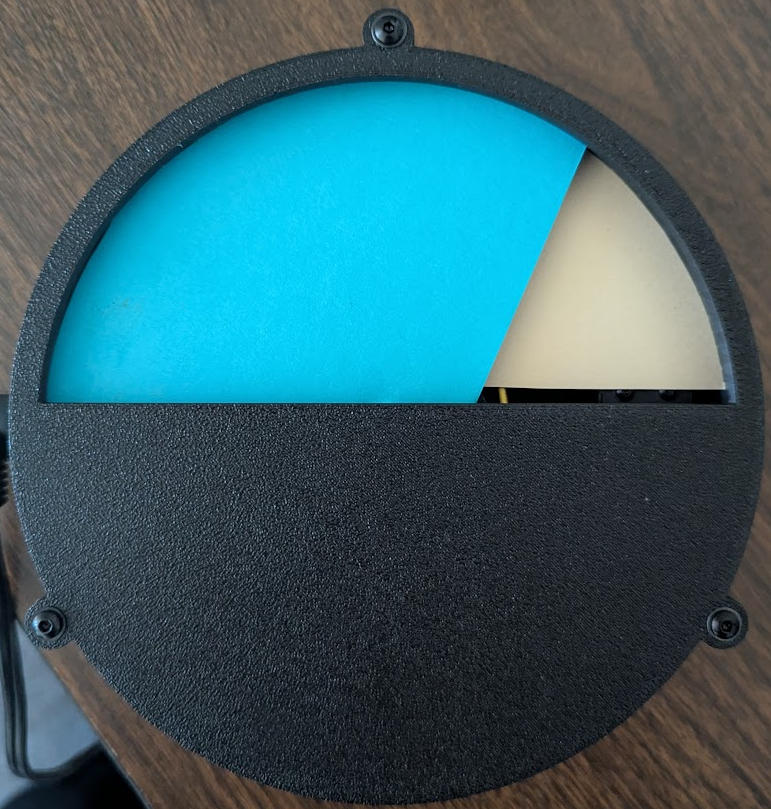

# Tide Clock
## Description
A simple web application that displays the current tide level for a given location. The application uses the NOAA API to fetch the necessary data and then displays it on a webpage. Code is all in MicroPython, controlled using a Raspberry Pi Pico W.

## Parts
- Raspberry Pi Pico W
- Stepper Motor and Driver Board (https://www.amazon.com/gp/product/B00LPK0E5A?ie=UTF8&psc=1)

## Images

